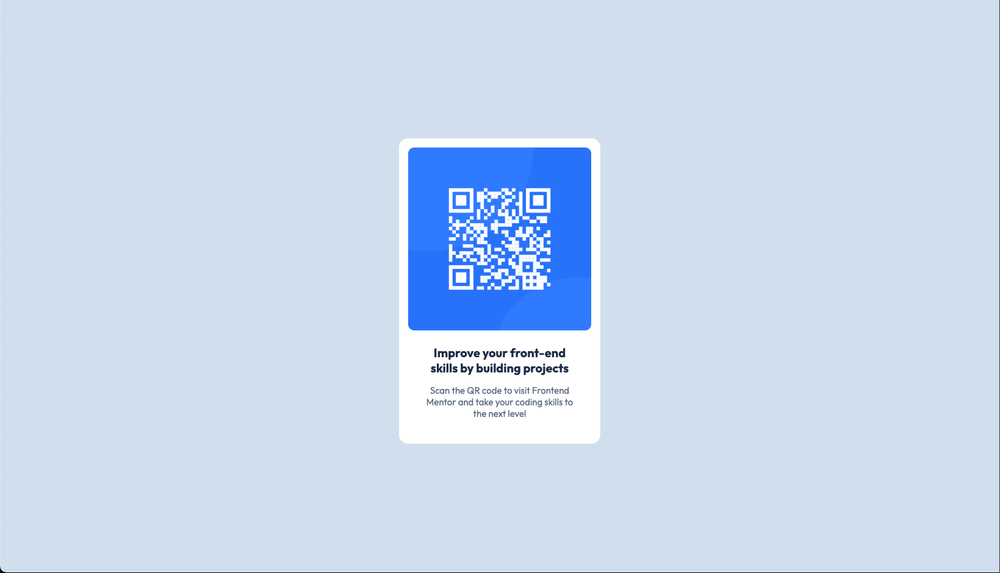

# Frontend Mentor - QR code component solution

This is a solution to the [QR code component challenge on Frontend Mentor](https://www.frontendmentor.io/challenges/qr-code-component-iux_sIO_H). Frontend Mentor challenges help you improve your coding skills by building realistic projects. 

## Table of contents

- [Overview](#overview)
  - [Screenshot](#screenshot)
  - [Links](#links)
- [My process](#my-process)
  - [Built with](#built-with)
  - [What I learned](#what-i-learned)
  - [Continued development](#continued-development)
  - [Useful resources](#useful-resources)
- [Author](#author)

**Note: Delete this note and update the table of contents based on what sections you keep.**

## Overview

### Screenshot



### Links

- Solution URL: [Add solution URL here](https://github.com/ibzan79/frontend-qr-code-component)
- Live Site URL: [Add live site URL here](https://your-live-site-url.com)

## My process

### Built with

- Semantic HTML5
- CSS custom properties
- Flexbox
- Mobile-first workflow

### What I learned

- Centering layouts effectively using Flexbox with a `main` container
```css
main {
  min-height: 100vh;
  display: flex;
  justify-content: center;
  align-items: center;
}
```

- Using `max-width` instead of fixed widths to create responsive cards
```css
.qr-code-component {
  max-width: 320px;
  width: 100%;
}
```

- Separating padding responsibilities between container and text elements
```css
.qr-code-component {
  padding: 15px;
}

.qr-text {
  padding: 10px 20px;
}
```

- Allowing images to scale naturally with `width: 100%` for better responsiveness  
```css
.qr-code-component img {
  width: 100%;
  height: auto;
  display: block;
}
```

### Continued development

- Improve accessibility by adding ARIA attributes and semantic landmarks  
- Refine spacing and typography for enhanced readability and visual hierarchy  
- Practice more Frontend Mentor challenges to strengthen layout and CSS skills  

### Useful resources

- [MDN Flexbox guide](https://developer.mozilla.org/en-US/docs/Web/CSS/CSS_Flexible_Box_Layout/Basic_Concepts_of_Flexbox) - Comprehensive guide to Flexbox layout  
- [Google Fonts (Outfit)](https://fonts.google.com/specimen/Outfit) - Font used for this project

## Author

- Frontend Mentor - [@ibzan79](https://www.frontendmentor.io/profile/ibzan79)  
- GitHub - [ibzan79](https://github.com/ibzan79)
